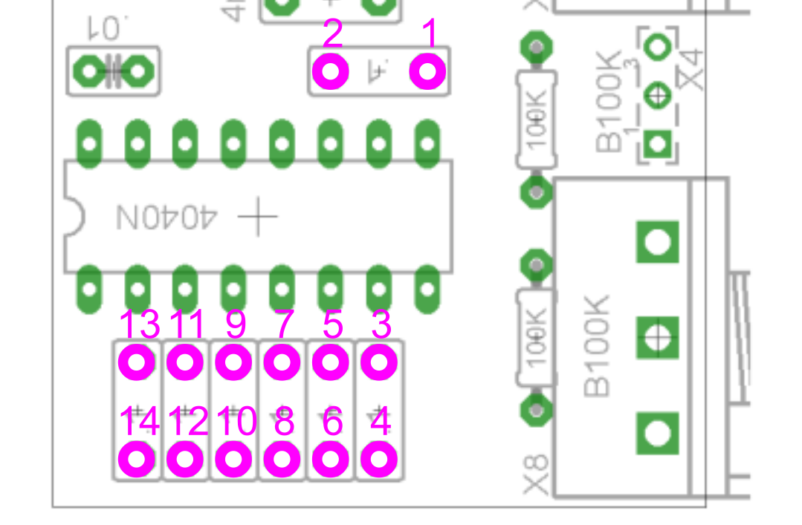

# VC 4046 Wave Shaper build notes

## PCB assembly
To build this module you need to assemble three PCBs. One holds the board mounted jacks and connects via a pin header/socket pair to the second which holds board mounted pots and switch as well as components relating to the voltage controlled mixer and power input. Both are very straightforward to build. There are three Molex headers for wires leading to the main board; if you prefer of course you can skip the Molex and just solder these wires.

Pay attention to the silkscreen which indicates which side to fit the components on. The jacks, switch, pots, and jack board pin header face the front of the module. All other components on these two boards face the back.

The main PCB is the original Barton circuit board for the 4046 Wave Shaper. It is available from [Barton Musical Circuits](http://www.bartonmusicalcircuits.com), [Modular Addict](https://modularaddict.com), or [SynthCube](https://synthcube.com). This board is to be assembled as designed, except for the following modifications:

* Omit the pots.
* Move the 7 100 nF (0.1 µF) output capacitors (6 footprints to one side of the 4040N and 1 footprint to the other side) to pads 2 and 3 of the pot footprints.
* Solder a 14 conductor ribbon cable to the vacant capacitor footprints (see below).
* Omit the 100k output stage feedback resistor located at the end of the TL072. Instead solder here two wires to be connected to the pot/switch board. A pair of wires peeled off a rainbow ribbon cable works well. In addition, as designed, solder two wires to the IN/OUT pins, and three wires to the SA/SB/SC pins.
* Instead of a 10 pin header on the component side, fit an unshrouded 10 pin header (2x5) **on the reverse side.**
* Omit the two 10 µF rail to ground capacitors.
* Replace the two 10R resistors with jumpers or 0R resistors.

## Final assembly

First secure a 10 mm Nylon spacer to the pot/switch board using the mounting hole.

The board mounted pots, switch, and jacks are used to secure two of the PCBs to the front panel, with the pin header on one plugging in to the pin socket on the other. 

Plug the main PCB's 10 pin header into the 10 pin socket on the pot/switch board. **Check to make sure the header and socket are aligned correctly.** 

Fit a 14 pin IDC connector to the ribbon cable, making sure to get the orientation correct (see below). The cable should be cut to reach the 14 pin shrouded header on the pot/switch board. Plug it in.

Fit two 2 pin Molex connectors to the IN/OUT wires and the wires soldered to the 100k resistor footprint, and a 3 pin Molex connector to the wires connected to SA/SB/SC. The wires should be cut to reach the Molex headers on the other two boards; see silkscreen to determine which wire goes where in the Molex connectors. (SA and SC go to High and Low, respectively. The 100k resistor wires can go either way.) Plug them in.

Now you can test the module to see if anything needs troubleshooting. Once you're happy, unplug the main board from the pot/switch board. Put a dab of epoxy on the end of the Nylon spacer. Replace the main board **(check the alignment again!)** and let the epoxy harden. 

Now see if you have 8 knobs that will fit.

## Ribbon cable

The conductors are numbered consecutively 1 to 14; the one with the red stripe is number 1. They are soldered as shown:

On the IDC connector, as with a Eurorack/Kosmo style power cable, pin 1 is on the top right when the orientation key is up. So the red stripe should be on the right.